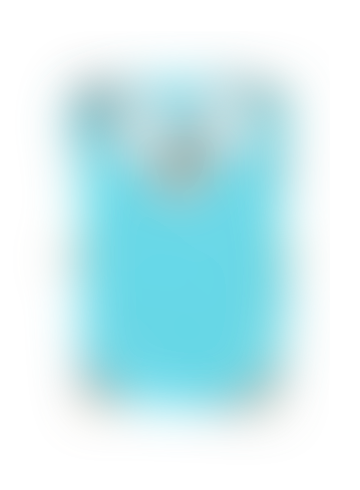

# sqip does SVG-based LQIP image creation



[](https://godoc.org/github.com/denisbrodbeck/sqip) [](https://goreportcard.com/report/github.com/denisbrodbeck/sqip)

… because even blurred preview images need to look good :godmode:

## Installation

Get the cli app directly to your `$GOPATH/bin` with

```bash
go get -u github.com/denisbrodbeck/sqip/cmd/sqip
```

Import the library with

```golang
import "github.com/denisbrodbeck/sqip"
```

## Credits

* [Michael Fogleman](https://github.com/fogleman) and his awesome [primitive](https://github.com/fogleman/primitive) project
* [José Manuel Pérez](https://jmperezperez.com/about-me/) for his [awesome explanation](https://jmperezperez.com/svg-placeholders/) of [various](https://jmperezperez.com/more-progressive-image-loading/) [image](https://jmperezperez.com/lazy-loading-images/) [loading](https://jmperezperez.com/webp-placeholder-images/) [techniques](https://jmperezperez.com/medium-image-progressive-loading-placeholder/)
* [sqip](https://github.com/technopagan/sqip) for the research and initial nodejs implementation

The Go gopher was created by [Denis Brodbeck](https://github.com/denisbrodbeck), based on original artwork from [Renee French](http://reneefrench.blogspot.com/) and [Takuya Ueda](https://github.com/golang-samples/gopher-vector).

## License

The MIT License (MIT) — [Denis Brodbeck](https://github.com/denisbrodbeck). Please have a look at the [LICENSE](LICENSE) for more details.
